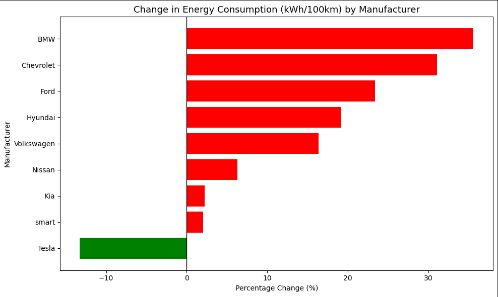
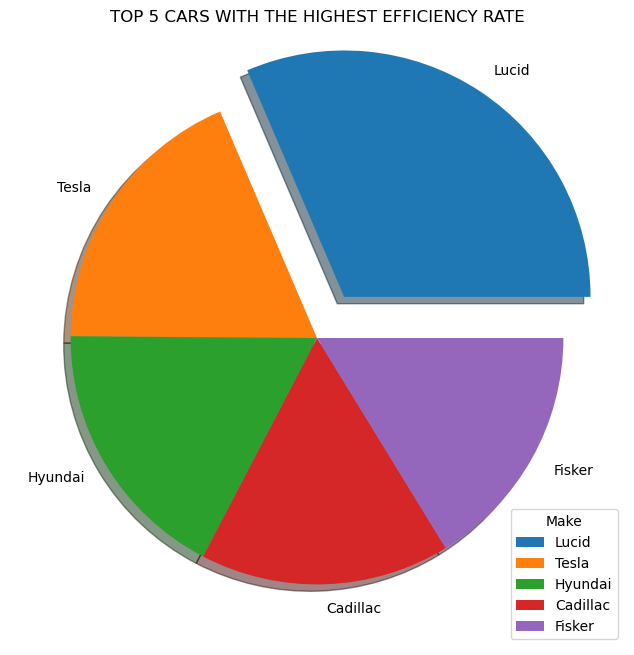

# 🔋 Battery Electric Vehicle (BEV) Performance & Efficiency Analysis  

This repository contains **my individual contributions** to a group project analyzing the technological progression, performance trends, and efficiency improvements of Battery Electric Vehicles (BEVs) over time.  

The analysis explores trends in:
- Range (km)
- Recharge time
- Energy consumption efficiency
- Manufacturer-level performance differences

All visualizations in this repository were created by me using Python, pandas, matplotlib, seaborn, and NumPy.

---

## 👥 Project Context (Group Work)

This project was originally completed as part of a group assignment.  
To maintain academic integrity, **this repository includes only the work I personally completed**, including:

- My visualizations  
- My analysis  
- My insights  
- My notebook (to be uploaded)  

No group files or collaborator names are included.

---

## 👩🏽‍💻 My Contributions

### ✔ **1. Range (km) Trend Analysis**  
- Analyzed how BEV driving range has evolved year by year.  
- Created a trend plot showing progressive improvements in range.  
- Identified performance jumps associated with newer battery technologies.

### ✔ **2. Recharge Time Trend Analysis**  
- Visualized the reduction in recharge times across BEV models.  
- Compared early-generation BEVs with modern fast-charging vehicles.  
- Highlighted the relationship between battery capacity and charge time.

### ✔ **3. Energy Consumption Improvement**  
- Analyzed energy efficiency metrics (kWh/100km).  
- Created visuals showing improvements in consumption efficiency.  
- Interpreted how advancements in battery chemistry and drivetrain engineering influence consumption.

### ✔ **4. Manufacturer Efficiency Comparison**  
- Compared BEV manufacturers on energy efficiency and performance.  
- Created a visualization ranking the most efficient and least efficient brands.  
- Explained differences based on model generations and innovation timelines.

### ✔ **5. Insight Writing & Interpretation**  
- Summarized findings for each visualization.  
- Interpreted trends in a business-oriented, technology-aware manner.

---

## 🧠 Key Insights (Based on My Analysis)

### 🔹 1. **Range Improvement Over Time**  
BEV ranges have increased consistently, with later-generation models showing **significant jumps** due to improved battery density and energy optimization.

### 🔹 2. **Recharge Times Have Decreased**  
There is a clear downward trend in recharge time, reflecting the adoption of **fast-charging technologies** (DC fast chargers, improved BMS systems).

### 🔹 3. **Energy Consumption Has Improved**  
Vehicles are becoming more energy-efficient, requiring fewer kWh per 100km.  
This improvement aligns with:
- Better battery management systems  
- More efficient motors  
- Regenerative braking enhancements  

### 🔹 4. **Efficiency Varies Across Manufacturers**  
Some brands consistently outperform others in energy consumption, suggesting:
- Better engineering  
- Newer battery packs  
- Lighter designs  
- More optimized powertrains  

---

## 📊 Visualizations  

### **Range (km) Trend Analysis**  
%20Trend%20Analysis.png)

### **Recharge Time Trend**  

### **Energy Consumption Improvement**  

### **Manufacturer Efficiency Comparison**  

